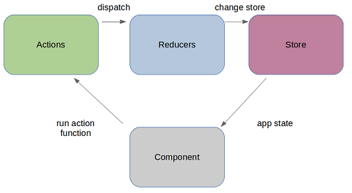

```text
██████╗  █████╗ ███████╗██╗  ██╗██████╗  ██████╗  █████╗ ██████╗ ██████╗ 
██╔══██╗██╔══██╗██╔════╝██║  ██║██╔══██╗██╔═══██╗██╔══██╗██╔══██╗██╔══██╗
██║  ██║███████║███████╗███████║██████╔╝██║   ██║███████║██████╔╝██║  ██║
██║  ██║██╔══██║╚════██║██╔══██║██╔══██╗██║   ██║██╔══██║██╔══██╗██║  ██║
██████╔╝██║  ██║███████║██║  ██║██████╔╝╚██████╔╝██║  ██║██║  ██║██████╔╝
╚═════╝ ╚═╝  ╚═╝╚══════╝╚═╝  ╚═╝╚═════╝  ╚═════╝ ╚═╝  ╚═╝╚═╝  ╚═╝╚═════╝ 
```                                                                    
🌟🌟🌟
# Grommet V2 REACT REUSE DASHBOARD Demo website


Dashboard demo website of custom reusable React components with global state store using Redux. Elegant UI/UX using React and GrommetV2

## Outline

- Based on official "Create React App"
- Based on latest React and Grommet V2 UI library
- Using styled-components for elegent design



## Framework
https://v2.grommet.io/components

## To Run It Locally

```
git clone https://github.com/nrydevopswatch/dashboard
```
```
cd dashboard
```
```
npm install
```
```
npm start
```
It should automatically launch in your web browser on localhost:3000

🌟🌟🌟